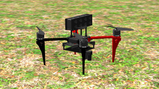
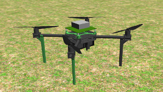
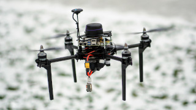
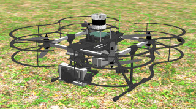
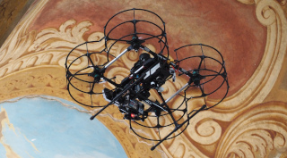

# Multi-robot Systems Group UAV system


The [Multi-robot Systems Group](http://mrs.felk.cvut.cz) is a robotics lab at the [Czech Technical University in Prague](https://www.cvut.cz/).
We specialize on multi-rotor helicopters, and for them specifically, we develop this control, estimation, and simulation system.
We think that real-world and replicable experiments should support excellent research and science in robotics.
Thus our platform is built to allow safe real-world experimental validation of approaches in planning, control, estimation, computer vision, tracking, and more.

## Build status

|                                                              | aarch64                                                                                                                                                                             | x86_64                                                                                                                                                                              |
|--------------------------------------------------------------|-------------------------------------------------------------------------------------------------------------------------------------------------------------------------------------|-------------------------------------------------------------------------------------------------------------------------------------------------------------------------------------|
| [Unstable (Nightly)](http://github.com/ctu-mrs/ppa-unstable) | [](https://github.com/ctu-mrs/rosdistro/actions/workflows/unstable_arm64.yml) | [](https://github.com/ctu-mrs/rosdistro/actions/workflows/unstable_amd64.yml) |
| Stable                                                       | **TODO**                                                                                                                                                                            | **TODO**                                                                                                                                                                            |

## System structure

**TODO** diagram

### Hardware APIs

**TODO**

* PX4 API
* Tello API

### Simulators

**TODO**

* MRS Simulator
* Gazebo Simulator
* Coppelia Simulator

## System properties

The platform is

* built using [Robot Operating System](https://www.ros.org/) Noetic,
* meant to be executed entirely onboard,
* can be deployed on any multi-rotor vehicle, given **TODO** **write about hardware API**
* for both indoor and outdoor,
* supports multi-robot experiments using [Nimbro network](https://github.com/ctu-mrs/nimbro_network) communication.
* provides both: agile flying and robust control.


## [Documentation](https://ctu-mrs.github.io/)

The primary source of documentation is here: [https://ctu-mrs.github.io/](https://ctu-mrs.github.io/).
However, the website only scratches a surface of what it should contain (and we know it).
Our system is a research-oriented platform, and it evolves rapidly.
Most of our users are either researchers (who already know the platform) or freshmen students (who might not know ROS at all).
Maintaining up-to-date documentation for such an audience is hard work, since we mostly spend our time developing the system while using it for our research.
So instead, we aim at educating our students to look around the packages (each contains its own README), explore the launch files and be able to read the code, which we strive to keep readable.

[](https://github.com/ctu-mrs/mrs_uav_system/raw/diagram/mrs_uav_system_diagram.pdf)

The system follows a description presented in the article [doi.org/10.1007/s10846-021-01383-5](https://doi.org/10.1007/s10846-021-01383-5), [pdf](https://link.springer.com/content/pdf/10.1007/s10846-021-01383-5.pdf):
```
Baca, T., Petrlik, M., Vrba, M., Spurny, V., Penicka, R., Hert, D., and Saska, M.,
"The MRS UAV System: Pushing the Frontiers of Reproducible Research, Real-world Deployment, and
Education with Autonomous Unmanned Aerial Vehicles", J Intell Robot Syst 102, 26 (2021).
```

## Unmanned Aerial Vehicles

The MRS UAV system is currently pre-configured for the following UAV platforms, operated by the MRS.
The platforms are order by the size / payload capacity.

| Model        | Simulation                    | Real UAV                      |
|--------------|-------------------------------|-------------------------------|
| DJI f330     |  |        |
| DJI f450     |  |        |
| Holybro x500 |  |        |
| DJI f550     |  |        |
| Tarot t650   |  |        |
| NAKI II      |  |        |

## Related packages

The following packages are not necessarily part of our automated installation.
Therefore, you might need to clone them by yorself and place in your ROS workspace.
Some of those are forks of third party repositories.

| Package                                                                              | Description                                                                                   | 20.04                                                                                                                                                                |
|--------------------------------------------------------------------------------------|-----------------------------------------------------------------------------------------------|----------------------------------------------------------------------------------------------------------------------------------------------------------------------|
| [MRS Gazebo Extra Resources](https://github.com/ctu-mrs/mrs_gazebo_extras_resources) | *MRS System*-depended optional plugins and resources                                          | [](https://github.com/ctu-mrs/mrs_gazebo_extras_resources/actions) |
| [Example ROS packages](https://github.com/ctu-mrs/example_ros_packages)              | MRS ROS examples                                                                              | [](https://github.com/ctu-mrs/example_ros_packages/actions)               |
| [Nimbro network](https://github.com/ctu-mrs/nimbro_network)                          | ROS communication layer for multiple independent machines                                     | [](https://github.com/ctu-mrs/nimbro_network/actions)                           |
| [MRS optic flow](https://github.com/ctu-mrs/mrs_optic_flow)                          | GPU-accelerated optic flow alorithm for UAV odometry                                          | [](https://github.com/ctu-mrs/mrs_optic_flow/actions)                           |
| [Hector SLAM](https://github.com/tu-darmstadt-ros-pkg/hector_slam)                   | 2D Laser-based LIDAR SLAM, [how to](https://ctu-mrs.github.io/docs/software/hector_slam.html) |                                                                                                                                                                      |
| [Hector SLAM](https://github.com/ctu-mrs/hector_slam) - MRS fork                     | + Nodeleted, [how to](https://ctu-mrs.github.io/docs/software/hector_slam.html)               | [](https://github.com/ctu-mrs/hector_slam/actions)                                 |
| [MRS Serial](https://github.com/ctu-mrs/mrs_serial)                                  | serial line interface to ROS, communicates using the BACA protocol                            | [](https://github.com/ctu-mrs/mrs_serial/actions)                                   |
| [UVDAR](https://github.com/ctu-mrs/uvdar)                                            | mutual localization of UAVs using Ultra-Violet LED blinkers                                   | [](https://github.com/ctu-mrs/uvdar_core/actions)                                   |
| [UVDAR gazebo plugin](https://github.com/ctu-mrs/uvdar_gazebo_plugin)                | Gazebo plugin for UVDAR                                                                       | [](https://github.com/ctu-mrs/uvdar_gazebo_plugin/actions)                 |
| [trajectory loader](https://github.com/ctu-mrs/trajectory_loader)                    | Loading UAV trajectories from CSV files                                                       | [](https://github.com/ctu-mrs/trajectory_loader/actions)                     |
| [Bluefox2](https://github.com/ctu-mrs/bluefox2)                                      | MV Bluefox2 driver, MRS fork                                                                  | [](https://github.com/ctu-mrs/bluefox2/actions)                                       |
| [Object detection](https://github.com/ctu-mrs/object_detect)                         | Object detection by color segmentation                                                        | [](https://github.com/ctu-mrs/object_detect/actions)                             |
| [MRS utils](https://github.com/ctu-mrs/mrs_utils)                                    | Development utils                                                                             | [](https://github.com/ctu-mrs/mrs_utils/actions)                                     |
| [OctomapTools](https://github.com/ctu-mrs/octomap_tools)                             | Octomap visualization and manipulation                                                        |                                                                                                                                                                      |

## Backwards compatibility and updates

We do not guarantee backwards compatibility at any time.
The platform is evolving according to the needs of the MRS group.
Updates can be made that are not going to be compatible with users local configs, simulation worlds, tmux sessions, etc.
However, when we change something which requires user action to maintain compatibility, we will create an issue in this repository labelled **users-read-me**.
Subscribe to this repository updates and issues by clicking the **Watch** button in the top-right corner of this page.
Recent changes requiring user action:

* August, 2023: **TODO** **Rehaul of the entiner MRS UAV System**
* January 17, 2023: [Updates for px4 firmware v1.13.2](https://github.com/ctu-mrs/mrs_uav_system/issues/150)
* March 8, 2022: [mrs_lib::Transformer interface updated](https://github.com/ctu-mrs/mrs_uav_system/issues/136)
* December 09, 2021: [not building with --march=native anymore](https://github.com/ctu-mrs/mrs_uav_system/issues/126)
* December 25, 2020: [Updated controller interface, updated thrust curve parametrization](https://github.com/ctu-mrs/mrs_uav_system/issues/33)
* December 15, 2020: [Rework of simulation UAV spawning mechanism, Noetic update](https://github.com/ctu-mrs/mrs_uav_system/issues/32)
* November 12, 2020: [GPS coordinates within Gazebo world need changing](https://github.com/ctu-mrs/mrs_uav_system/issues/22)
* November 12, 2020: [Rangefinder fusion needs enabling in simulation sessions](https://github.com/ctu-mrs/mrs_uav_system/issues/21)

## Installation

### Native installation

1. Install the Robot Operating System (Noetic):
```bash
curl https://ctu-mrs.github.io/ppa-unstable/add_ros_ppa.sh | bash
sudo apt install ros-noetic-desktop-full
```

2. Select which version of the MRS UAV System you want to install.

For **stable** version, add the following PPA:
```bash
**TODO**
```
For **unstable** (nightly-build) of the system, add the following PPA:
```bash
curl https://ctu-mrs.github.io/ppa-unstable/add_ppa.sh | bash
```

Then, install the MRS UAV System:
```bash
sudo apt install ros-noetic-mrs-uav-system
```

3. Follow these instructions ([starting the simulation](https://ctu-mrs.github.io/docs/simulation/howto.html), **TODO update**) for starting the example simulation sessions.

4. Follow these instruction (**TOOD**) for creating your own catkin workspace and building your packages with the MRS UAV system.

### Singularity and Docker

Please, follow this link to learn how to run our system using Singularity.

* [MRS Singularity](https://github.com/ctu-mrs/mrs_singularity/)

Our Singularity images are built almost completely from Docker images.
The following link points to our Docker HUB repository.

* [Docker Images](https://hub.docker.com/u/ctumrs)

#### "I want the Linux environment people from MRS works with"

Great! In that case you want to install Tomas's Linux-setup.
**Beware!** This might alter your existing configuration of some Linux tools (Vim, Tmux, i3wm, ranger, ...).
Refer to its [README](https://github.com/klaxalk/linux-setup), for more information.
Installation is *not* obligatory and the MRS UAV system will work without it.

Paste following code into your terminal and press **enter**
```bash
cd /tmp
echo "mkdir -p ~/git
cd ~/git
sudo apt-get -y install git
git clone https://github.com/klaxalk/linux-setup
cd linux-setup
./install.sh" > run.sh && source run.sh
```

For help with using the system, you can also refer to the [MRS Cheatsheet](https://ctu-mrs.github.io/docs/introduction/cheatsheet.html).
