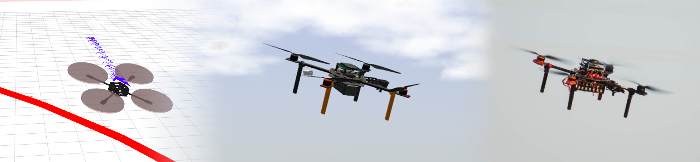
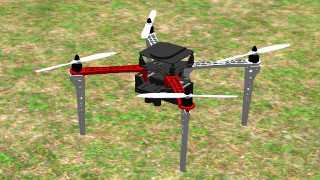
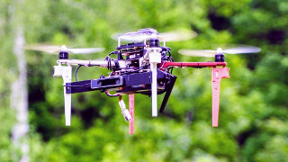
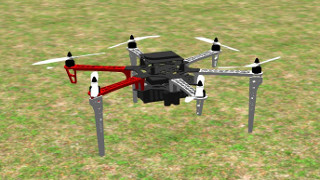
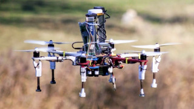
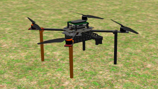
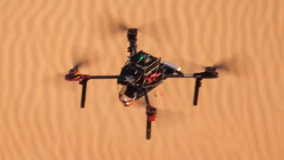

# Multi-robot Systems Group UAV system


The [Multi-robot Systems Group](http://mrs.felk.cvut.cz) is a robotics lab at the [Czech Technical University in Prague](https://www.cvut.cz/).
We mostly work with multi-rotor helicopters, and for them specifically, we develop this control, estimation, and simulation platform.
We think that real-world and replicable experiments should support excellent research and science in robotics.
Thus our platform is built to allow safe verification of approaches in planning, control, estimation, computer vision, tracking, and more.

### Build Status

| Component                                                   | 18.04                                                                                                                                       | 20.04                                                                                                                                      |
|-------------------------------------------------------------|---------------------------------------------------------------------------------------------------------------------------------------------|--------------------------------------------------------------------------------------------------------------------------------------------|
| [mrs_uav_system](https://github.com/ctu-mrs/mrs_uav_system) | [](https://github.com/ctu-mrs/mrs_uav_system/actions) | [](https://github.com/ctu-mrs/mrs_uav_system/actions) |
| [uav_core](https://github.com/ctu-mrs/uav_core)             | [](https://github.com/ctu-mrs/uav_core/actions)             | [](https://github.com/ctu-mrs/uav_core/actions)             |
| [simulation](https://github.com/ctu-mrs/simulation)         | [](https://github.com/ctu-mrs/simulation/actions)         | [](https://github.com/ctu-mrs/simulation/actions)         |
| [linux-setup](https://github.com/klaxalk/linux-setup)       | [](https://github.com/klaxalk/linux-setup/actions)        | [](https://github.com/klaxalk/linux-setup/actions)        |

## System properties

The platform is

* built using [Robot Operating System](https://www.ros.org/) (Melodic, Noetic),
* meant to be executed entirely onboard,
* can be deployed on any multi-rotor vehicle, given it is equipped with a [PX4](https://github.com/ctu-mrs/px4_firmware)-compatible [flight controller](https://pixhawk.org/),
* for both indoor and outdoor,
* supports multi-robot experiments using [Nimbro network](https://github.com/ctu-mrs/nimbro_network) communication.
* provides both: agile flying and robust control.


### Documentation

The primary source of documentation is here: [https://ctu-mrs.github.io/](https://ctu-mrs.github.io/).
However, the website only scratches a surface of what it should contain (and we know it).
Our system is a research-oriented platform, and it evolves rapidly.
Most of our users are either researchers (who already know the platform) or freshmen students (who might not know ROS at all).
Maintaining up-to-date documentation for such an audience is hard work, since we mostly spend our time developing the system while using it for our research.
So instead, we aim at educating our students to look around the packages (each contains its own README), explore the launch files and be able to read the code, which we strive to keep readable.

The system follows a description presented in the preprint [arXiv:2008.08050](https://arxiv.org/abs/2008.08050), [pdf](https://arxiv.org/pdf/2008.08050):
```
Baca, T., Petrlik, M., Vrba, M., Spurny, V., Penicka, R., Hert, D., and Saska, M. (2020),
"The MRS UAV System: Pushing the Frontiers of Reproducible Research, Real-world Deployment, and
Education with Autonomous Unmanned Aerial Vehicles", 2020, arXiv:2008.08050
```

### Unmanned Aerial Vehicles

The MRS UAV system is currently pre-configured for the following UAV platforms, operated by the MRS:

| Model      | Simulation                    | Real UAV                |
|------------|-------------------------------|-------------------------|
| DJI f450   |  |  |
| DJI f550   |  |  |
| Tarot t650 |  |  |

## Related packages

The following packages are not necessarily part of our automated installation.
Therefore, you might need to clone them by yorself and place in your ROS workspace.
Some of those are forks of third party repositories.

| Package                                                                              | Description                                                                                   | 18.04                                                                                                                                                                 | 20.04                                                                                                                                                                |
|--------------------------------------------------------------------------------------|-----------------------------------------------------------------------------------------------|-----------------------------------------------------------------------------------------------------------------------------------------------------------------------|----------------------------------------------------------------------------------------------------------------------------------------------------------------------|
| [MRS Gazebo Extra Resources](https://github.com/ctu-mrs/mrs_gazebo_extras_resources) | *MRS System*-depended optional plugins and resources                                          | [](https://github.com/ctu-mrs/mrs_gazebo_extras_resources/actions) | [](https://github.com/ctu-mrs/mrs_gazebo_extras_resources/actions) |
| [Example ROS packages](https://github.com/ctu-mrs/example_ros_packages)              | MRS ROS examples                                                                              | [](https://github.com/ctu-mrs/example_ros_packages/actions)               | [](https://github.com/ctu-mrs/example_ros_packages/actions)               |
| [Nimbro network](https://github.com/ctu-mrs/nimbro_network)                          | ROS communication layer for multiple independent machines                                     | [](https://github.com/ctu-mrs/nimbro_network/actions)                           | [](https://github.com/ctu-mrs/nimbro_network/actions)                           |
| [MRS optic flow](https://github.com/ctu-mrs/mrs_optic_flow)                          | GPU-accelerated optic flow alorithm for UAV odometry                                          | [](https://github.com/ctu-mrs/mrs_optic_flow/actions)                           | [](https://github.com/ctu-mrs/mrs_optic_flow/actions)                           |
| [Hector SLAM](https://github.com/tu-darmstadt-ros-pkg/hector_slam)                   | 2D Laser-based LIDAR SLAM, [how to](https://ctu-mrs.github.io/docs/software/hector_slam.html) |                                                                                                                                                                       |                                                                                                                                                                      |
| [Hector SLAM](https://github.com/ctu-mrs/hector_slam) - MRS fork                     | + Nodeleted, [how to](https://ctu-mrs.github.io/docs/software/hector_slam.html)               | [](https://github.com/ctu-mrs/hector_slam/actions)                                 | [](https://github.com/ctu-mrs/hector_slam/actions)                                 |
| [MRS Serial](https://github.com/ctu-mrs/mrs_serial)                                  | serial line interface to ROS, communicates using the BACA protocol                            | [](https://github.com/ctu-mrs/mrs_serial/actions)                                   | [](https://github.com/ctu-mrs/mrs_serial/actions)                                   |
| [UVDAR](https://github.com/ctu-mrs/uvdar)                                            | mutual localization of UAVs using Ultra-Violet LED blinkers                                   | [](https://github.com/ctu-mrs/uvdar_core/actions)                                   | [](https://github.com/ctu-mrs/uvdar_core/actions)                                   |
| [UVDAR gazebo plugin](https://github.com/ctu-mrs/uvdar_gazebo_plugin)                | Gazebo plugin for UVDAR                                                                       | [](https://github.com/ctu-mrs/uvdagazebo_plugin/actions)                   | [](https://github.com/ctu-mrs/uvdagazebo_plugin/actions)                   |
| [trajectory loader](https://github.com/ctu-mrs/trajectory_loader)                    | Loading UAV trajectories from CSV files                                                       | [](https://github.com/ctu-mrs/trajectory_loader/actions)                     | [](https://github.com/ctu-mrs/trajectory_loader/actions)                     |
| [Object detection](https://github.com/ctu-mrs/object_detect)                         | Object detection by color segmentation                                                        | [](https://github.com/ctu-mrs/object_detect/actions)                             | [](https://github.com/ctu-mrs/object_detect/actions)                             |
| [MBZIRC 2020 - Wall Building](https://github.com/ctu-mrs/mbzirc_2020_wall_building)  | System for automatic wall-building for MBZIRC 2020                                            | [](https://github.com/ctu-mrs/mbzirc_2020_wall_building/actions)     | [](https://github.com/ctu-mrs/mbzirc_2020_wall_building/actions)     |
| [Summer School 2019](https://github.com/ctu-mrs/mtsp_planning_task)                  | Summer School 2019 task - MTSP planning                                                       | [](https://github.com/ctu-mrs/mtsp_planning_task/actions)                   | [](https://github.com/ctu-mrs/mtsp_planning_task/actions)                   |
| [Summer School 2020](https://github.com/ctu-mrs/uvdar_leader_follower)               | Summer School 2020 task - UVDAR leader-follower                                               | [](https://github.com/ctu-mrs/uvdar_leader_follower/actions)             | [](https://github.com/ctu-mrs/uvdar_leader_follower/actions)             |

## Backwards compatibility and updates

We do not guarantee backwards compatibility at any time.
The platform is evolving according to the needs of the MRS group.
Updates can be made that are not going to be compatible with users local configs, simulation worlds, tmux sessions, etc.
However, when we change something which requires user action to maintain compatibility, we will create an issue in this repository labelled **users-read-me**.
Subscribe to this repository updates and issues by clicking the **Watch** button in the top-right corner of this page.
Recent changes requiring user action:

* December 15, 2020: [Rework of simulation UAV spawning mechanism, Noetic update](https://github.com/ctu-mrs/mrs_uav_system/issues/32)
* November 12, 2020: [GPS coordinates withing Gazebo world need changing](https://github.com/ctu-mrs/mrs_uav_system/issues/22)
* November 12, 2020: [Rangefinder fusion needs enabling in simulation sessions](https://github.com/ctu-mrs/mrs_uav_system/issues/21)

## Installation

Following options are provided, depending on who you are and what you want to do with the platform.
**Beware**, installing the system into a virtual machine may not be a good idea for you, unless you have a very powerfull computer.
Real-time simulations in Gazebo perform very poorly in virtual machines.

### "I have fresh Ubuntu install and want it quick and easy"

In this case we provide installation scripts that set everything up for you.
Our automated installation will:
* install Robot Operating System (ROS),
* install other dependencies such *git*, *gitman*,
* clone [uav_core](https://github.com/ctu-mrs/uav_core), [simulation](https://github.com/ctu-mrs/simulation), [example_ros_packages](https://github.com/ctu-mrs/example_ros_packages) into *~/git*,
* install more dependencies such as *tmux* and *tmuxinator*
* create our ros workspace in ```~/mrs_workspace``` for the *uav_core* and *simulation*,
* create a ros workspace in ```~/workspace``` for *examples*,
* link our packages to the workspaces,
* compile the workspaces,
* added configuration lines into your *~/.bashrc*.

To start the automatic installation, please paste the following code into your terminal and press **enter**.
You might be prompted a few times to confirm something by pressing enter:
```bash
cd /tmp
echo '
GIT_PATH=~/git
mkdir -p $GIT_PATH
cd $GIT_PATH
sudo apt-get -y install git
git clone https://github.com/ctu-mrs/mrs_uav_system
cd mrs_uav_system
git checkout master
git pull
./install.sh -g $GIT_PATH
source ~/.bashrc' > clone.sh && source clone.sh
```

### "I already have ROS and just want to peek in"

If you already have ROS installed and if you are fluent with *workspaces*, *.bashrc*, *catkin tools*, etc., feel free to clone our repositories individually.
The [uav_core](https://github.com/ctu-mrs/uav_core) repository integrates our UAV control system.
Please follow its README for further instructions on how to install its particular dependencies.

The [simulation](https://github.com/ctu-mrs/simulation) repository provides resources for *Gazebo/ROS* simulation, including px4 Simulation-in-the-Loop (SITL), UAV models and useful sensor plugins.
Please follow its README for further instructions on how to install prerequisities.

### "I want the Linux environment people from MRS works with"

Great! In that case you want to install Tomas's Linux-setup.
**Beware!** This might alter your existing configuration of some Linux tools (Vim, Tmux, i3wm, ranger, ...).
Refer to its [README](https://github.com/klaxalk/linux-setup), for more information.
Installation is *not* obligatory and the MRS UAV system will work without it.

Paste following code into your terminal and press **enter**
```bash
cd /tmp
echo "mkdir -p ~/git
cd ~/git
sudo apt-get -y install git
git clone https://github.com/klaxalk/linux-setup
cd linux-setup
./install.sh" > run.sh && source run.sh
```
